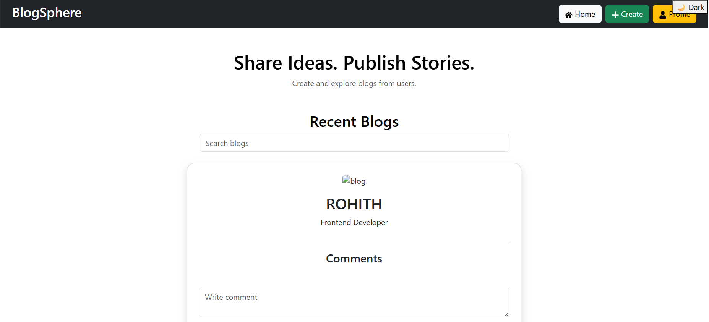

# 📝 Blogpage - Full Stack Blog Application

[](https://www.python.org/)
[](https://www.djangoproject.com/)
[](https://reactjs.org/)
[](https://vitejs.dev/)
[](https://opensource.org/licenses/MIT)

A modern, high-performance full-stack blogging platform built with **Django REST Framework** and **React (Vite)**. Designed for seamless content creation, user engagement, and a polished user experience.

---

## 📸 Preview



---

## 🚀 Features

### 👤 User Management
- **Secure Authentication**: Signup, Login, and Logout functionality.
- **Profile Customization**: Manage user details and personal blog posts.

### ✍️ Content Creation
- **Blog CRUD**: Create, Read, Update, and Delete blog posts.
- **Image Support**: Upload hero images for blogs with automatic handling.
- **Rich Interaction**: Like and Comment on posts to foster community engagement.

### 💻 Technical Highlights
- **RESTful API**: Clean and documented endpoints for frontend-backend communication.
- **Responsive Design**: Fully optimized for mobile and desktop browsers.
- **Fast Build**: Powered by Vite for near-instant hot module replacement (HMR).

---

## 📂 Project Architecture

```text
Blogpage/
├── blogsite/          # Django REST Framework Backend
│   ├── blogs/         # Blog application logic (Models, Views, Serializers)
│   ├── blogsite/      # Main configuration (Settings, URLs)
│   ├── media/         # Uploaded blog images
│   └── manage.py
├── frontend/          # React + Vite Frontend
│   ├── src/           # Components, Pages, and Assets
│   ├── public/        # Static assets
│   └── package.json
└── README.md
```

---

## 🛠️ Installation & Setup

### 1. Prerequisites
- Python 3.10+
- Node.js & npm
- Git

### 2. Clone the Repository
```bash
git clone https://github.com/KoyalkarSahithi/Blogpage.git
cd Blogpage
```

### 3. Backend Setup (Django)
```bash
cd blogsite
# Create and activate virtual environment
python -m venv env
source env/bin/activate  # On Windows: env\Scripts\activate

# Install dependencies
pip install django djangorestframework django-cors-headers pillow

# Run migrations and start server
python manage.py migrate
python manage.py runserver
```

### 4. Frontend Setup (React)
```bash
cd ../frontend
npm install
npm run dev
```

---

## 🧪 Technologies Used

| Layer | Technology |
| :--- | :--- |
| **Frontend** | React, Vite, CSS3, JavaScript (ES6+) |
| **Backend** | Python, Django, Django REST Framework |
| **Database** | SQLite (Development) |
| **Images** | Pillow (Python Imaging Library) |

---

## 🤝 Contributing

Contributions are welcome! Please feel free to submit a Pull Request.

1. Fork the Project
2. Create your Feature Branch (`git checkout -b feature/AmazingFeature`)
3. Commit your Changes (`git commit -m 'Add some AmazingFeature'`)
4. Push to the Branch (`git push origin feature/AmazingFeature`)
5. Open a Pull Request

---

## 📄 License

Distributed under the MIT License. See `LICENSE` for more information.

---

## ✉️ Contact

**Sahithi Koyalkar** - [GitHub](https://github.com/KoyalkarSahithi)

Project Link: [https://github.com/KoyalkarSahithi/Blogpage](https://github.com/KoyalkarSahithi/Blogpage)
